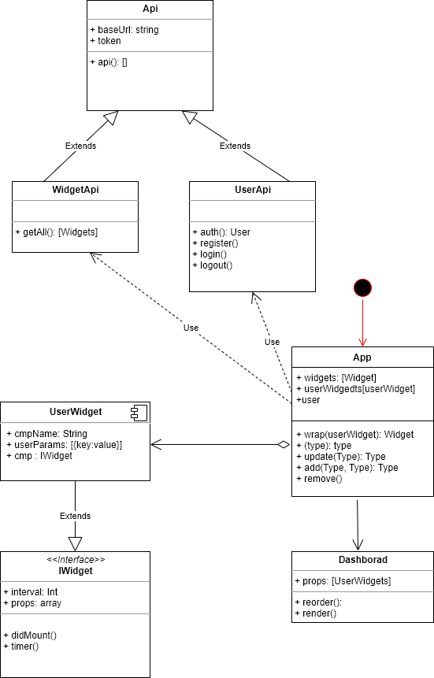

# The Fantastic 4 Dashboard

**made by** *François Annabi   -   Fatymata Gassama   -   Nicolas Coulot   -   Marie-Jeannette Cecora*

### **Description of project**

The purpose of this project is to implement a web application that works like Netvibes. The user will first connect to your application and then subscribe to different services you that are accessiblefrom your solution.Each of these services would offer different widgets.

---

### **Features**

1. The user registers on the application in order to obtain an account (cf User management)
1. The registered user then confirms their enrollment on the application before being able to use it (seeAuthentication / Identification)
1. The application then asks the authenticated user to subscribe to Services (cf Services) Each Service offers Widgets (see Widgets)
1. The authenticated user composes his Dashboard by inserting previously configured widget instances (see Dashboard & widget Instance)
1. A Timer allows to refresh the information displayed by the different widget instancespresent on theDashboard(seeTimer)

---

### **Sourcesfiles**
```bash
git clone git@git.epitech.eu:/francois.annabi@epitech.eu/dashboard
```
---

### **Projectfolders**
* Dashboard
    * api
    * app-dashboard

---

### **Frameworks used**
* NestJS pour le backend
* ReactJS pour le front

---

### **Installation and running the app**
```bash
npm install

npm run start:dev (pour backend)
npm start (pour frontend)
```
---

### **Using the app**
1. Register/Create an account
    |Name| Email| Password
    |-----|-----|-----|
    |Username|useremail@test.com|*****|

1. Connect to your account    

1. Choose the widgets you want to display on your dashboard

    |Service| Widget| Description |
    |-----|-----|-----|
    |Movies|OmdbSummary|Displays the description of movie chosen|
    |Movies|OmdbActors|Displays the actors of chosen movie|
    |Movies|OmdbPoster|Displays the poster of chosen movie|
    |-----|-----|-----|
    |News|News|Choose from your favorite news channel and display latest news|
    |-----|-----|-----|
    |Time/Date|ClockDate|Displays the current date|
    |Time/Date|ClockTime|Displays the current time|
    |-----|-----|-----|
    |Concerts|ShowCacaoConcerts|Displays all available concerts |
    |Concerts|ShowCacaoTickets|Displays the booked concerts|
    |-----|-----|-----|
    |Bike rental|Velib Map|Displays all velib stations close by with available bikes and slots|

1. Optimise the widgets with available parameters
1. Chosen widgets and its parameters will be available each time you connect to your dashboard
1. Each Widget  present on the Dashboard triggers automatically the necessary updates at the right time

---

### **File about JSON**
[about.json](http://localhost:3000/about.json)


---

### **UML Diagram**




___


